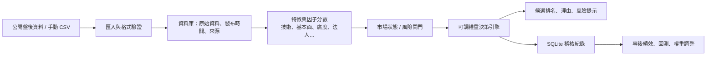

# 台股盤後決策支援系統：架構與執行指南

## 目前目標

建立一個免申請、免付費、以公開盤後資料或手動 CSV 為輸入的台股決策支援系統。它協助你排序、驗證與調整判斷；不提供盤中即時行情、不自動下單，也不保證預測結果。

## 系統架構



## 現有模組與責任

| 模組 | 責任 | 目前狀態 |
|---|---|---|
| `no_api_prototype.py` | Mock 行情、K 線、SMA、RSI、基礎掃描 | 已可測試 |
| `market_context.py` | 市場廣度、台灣與海外風險的市場狀態 | 已可測試 |
| `input_adapter.py` | 手動／公開資料整理後的 CSV 匯入與驗證 | 已可測試 |
| `weighted_analysis.py` | 因子權重、風險扣分、分類、稽核保存 | 已可測試 |
| `config/analysis_weights.json` | 你可調整的權重與門檻 | 可直接編輯 |
| `main.py` | 將 CSV 匯入、評分並保存結果 | 可直接執行 |

## 你每週／每日如何操作

1. **收盤後整理資料**：從合法公開來源或已下載檔案取得日行情、法人、月營收、財報、期權、夜盤結束後資料與海外風險資料。
2. **保留原始檔**：存入 `data/raw/YYYY-MM-DD/`，並記錄來源 URL、發布時間與抓取時間；不要覆蓋舊檔。
3. **計算 0–100 因子分數**：以一致規則填入 `data/factor_scores_YYYY-MM-DD.csv`。資料缺失填 50 並在 `note_` 欄說明，不可任意填高分。
4. **調整權重前先寫原因**：例如擔心海外風險時，提高 `global_risk`；偏好基本面時提高 `fundamentals`。每次改動都增加設定檔的 `version`。
5. **執行決策**：`python main.py data/factor_scores_YYYY-MM-DD.csv`。
6. **閱讀結果**：先看 `warnings` 與流動性／風險，再看總分；分類只表示觀察優先級，不是買賣指令。
7. **事後驗證**：記錄每個候選股的 1、3、5、10、20 日報酬、MFE、MAE 與最大回撤，按市場狀態評估是否該改權重。

## CSV 最小格式

使用 [sample_factor_scores.csv](data/sample_factor_scores.csv) 複製修改。必填欄位：

```text
symbol,as_of,technical,market_breadth,sector_rotation,fundamentals,institutional_flow,derivatives,global_risk,events,liquidity,valuation,risk_score
```

因子與 `risk_score` 都必須是 0–100；`as_of` 必須包含時區，例如 `2026-07-22T13:30:00+08:00`。可追加 `note_technical`、`note_fundamentals` 等欄位保存判斷理由。

## 最正確的開發順序

### 第 1 階段：資料基礎（現在）

- 以 CSV 手動匯入 20–50 檔自選股，確認每個分數的定義。
- 建立原始資料、發布時間與來源紀錄。
- 每日跑權重模型，累積至少 3–6 個月的影子訊號。

### 第 2 階段：公開資料自動化

- 先實作 TWSE／TPEx 的日行情、法人、估值與市場廣度擷取器。
- 再加入 MOPS 月營收／財報與 TAIFEX 盤後夜盤、期權資料。
- 每個擷取器都要有快取、速率限制、來源失敗警告與 CSV 備援。

### 第 3 階段：驗證與風控

- 實作訊號追蹤、交易成本、滑價、漲跌停與流動性限制。
- 依市場狀態做 walk-forward 回測，而非一次調到最佳。
- 加入組合曝險、產業集中度、最大回撤與暫停機制。

### 第 4 階段：模型（最後）

- 先比較簡單規則與 Logistic Regression，再考慮樹模型。
- 只用樣本外、含成本的結果決定模型是否值得保留。
- 模型輸出僅作機率與區間，不做自動下單。

## 今天就能開始的指令

```powershell
python main.py
python main.py data/sample_factor_scores.csv
python -m unittest -v
```

## 不可跨越的規則

- 不把公開盤後資料當成盤中即時資料。
- 不在回測使用事後才公開的法人、財報或修正資料。
- 不因總分高而忽略流動性、風險或資料過期警告。
- 不將設定檔或資料來源失敗時的舊資料標示成「最新」。
